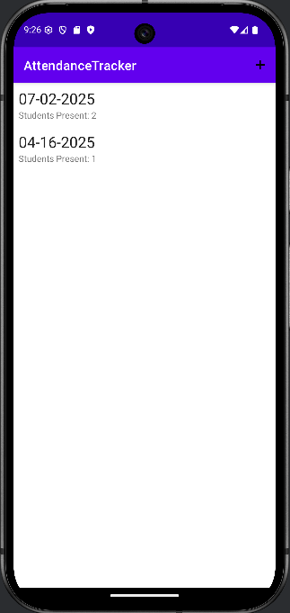
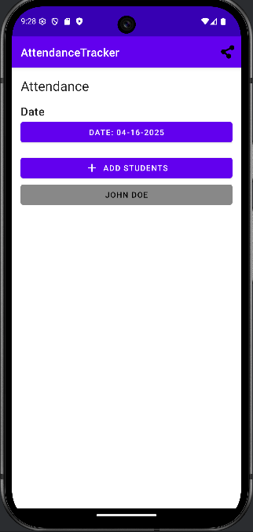

# Attendance Tracker

> A simple attendance tracking application

---

## Description

**Attendance Tracker** is an app that allows users to keep track of students for a class more conveniently using this simple android application. Users can give the phone to students to log themselves in without having to worry about students snooping around the application or phone.

---

## Installation & Setup

### Requirements
- Android Studio (includes Gradle and Kotlin)
- JDK 17

### Steps
* Open Android Studio
* Press `Project from Version Control`
* Input `https://github.com/AnthonyMaiT/attendanceTracker.git` into URL
* Change directory if needed
* Press Clone

---

## Features

Home Page
* Users can navigate either manage students or attendance records

Student List View
* The view list the student's name, student ID, and the picture associated with the student
* User can swipe left on a student to delete
* Users can press on the item to edit its detail
* User can add a new student by clicking the add button on the top right or when there is no student, an add student button would appear on the screen

Student View
* The view allows users to edit a student's first name, last name, and student ID
* When the birth date button is pressed, a dialog would pop up for users to select a date
* Users are able to take pictures using the camera button on the top right and view the picture when clicked on

Attendance Record List View
* The view list each attendance day along with the present student count for each day
* When there are no attendance records, a button would show up for users to add a new attendance. They could also click the add button on the top right
* Users can press on the item to edit its detail
* Users can swipe left on a record to delete it

Attendance Record View
* The view allows users to edit a attendance date and view students added to the day
* Users can press the top right share button to share the attendance date and respective students to another application
* Pressing the add button would allow students to add themeselves to the attendance list

Add Student to Attendance View
* The view allows users to add their student ID to be added to the attendance record after pressing add
* Corresponding snack bars would show based on what the user has inputted
* When the screen is moved away from, an air horn sound would play deterring students from moving away from the view

### 📸 Screenshots

| Feature | Screenshot |
|--------|------------|
| Home Screen |  |
| Student List View |  |
| Student View |  |
| Attendance List View |  |
| Attendance Record View |  |
| Add Student to Record View |  |

### Issues and Limitations
- Issues: None at the moment
- Limitations: 
    * Students can use volume buttons to bypass airhorn
    * Typing their own ID might take too much time
    * No way to use application for multiple classes
    * Students can take attendance for another student

### Future Features
* Scanning student ID for maximum efficiency with camera
* Sharing whole attendance list to a spreadsheet application
* Having multiple classes for teachers
* Using an information system API to store data
* Locking add student screen until password is typed

---

## Demo

[Watch Demo Video Here](https://youtu.be/DhAYu9buExM)

---

## Contact Information

If you have any questions please contact Anthony at anthonymai@vt.edu
